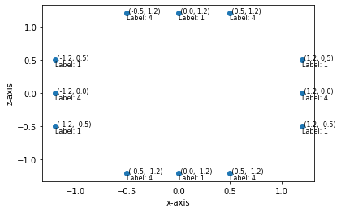
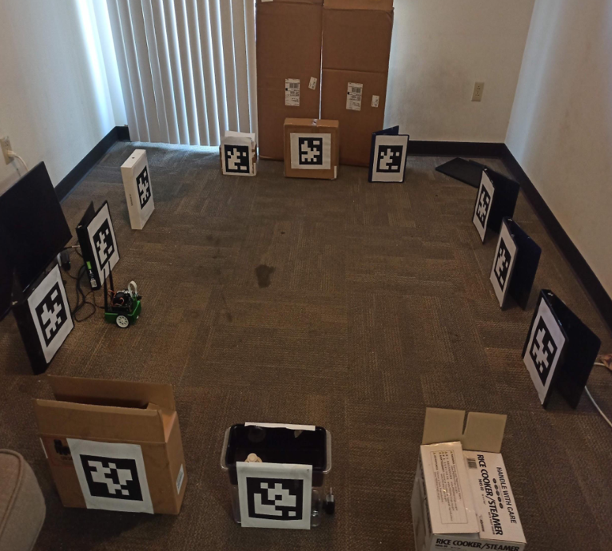
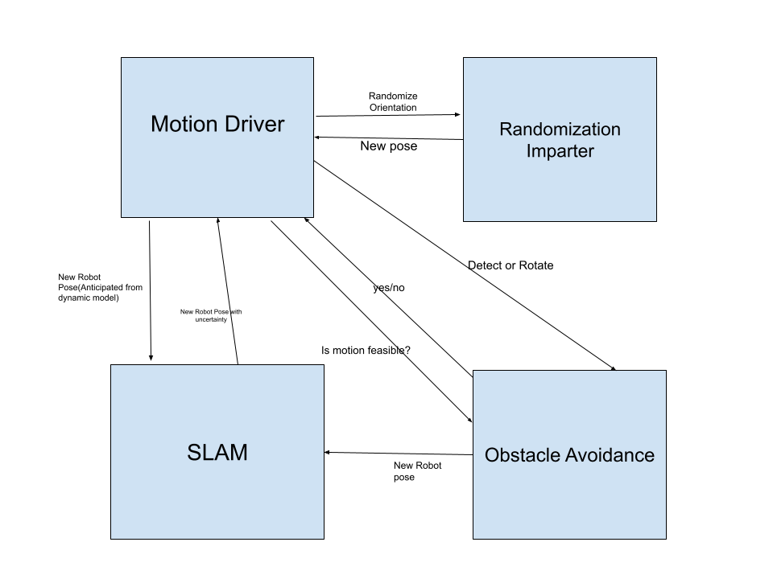
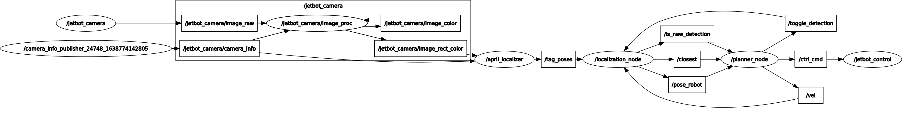

# Randomized-algorithm-for-area-coverage-by-JetBot

## Task
An environment is constructed(as asked in question) with april tags belonging to two distinct ids - 1 and 4, at its edges(20cm away from the edges, will explain the reason later). I couldn’t afford a 10ftx10ft space so like hw2/3/4, I’m doing this homework in the 2m x 2m space. Following is the pictorial representation of the arena and its corresponding image.

A robot is placed at a point in this arena. The task is to plan the motion of the robot to cover the entire 2m x 2m arena.

## Description of Planning Algorithm
I have used a randomized motion algorithm as my planning algorithm for this assignment. My motive was to create this assignment as close to the roomba’s random motion as possible.
I shall first discuss the architecture of the logical components of my randomized planning algorithm which will allow me to easily explain my algorithm.

## Architecture
Below is the diagram of logical architecture and control flow

The area-coverage system is logically decomposed into the following components:-
- Motion Driver:- Responsible for carrying out rectilinear motion of the robot in discrete time-steps.
- Randomization Imparter :- It rotates the robot in a random direction at a place without causing any rectilinear motion.
- Obstacle Avoidance :- Motion Driver proposes the new state of the robot based on the motion it can impart and this component is responsible to tell Motion Driver whether transitioning into such a state is feasible/allowed or not.
- SLAM :- Motion Driver after executing the motion sends the anticipated robot’s position to the SLAM component where Kalman Filter updates are performed using the robot’s anticipated position and covariance matrix and the detected marker’s covariance and estimated positions are also updated.

## Algorithm
The motivation behind using the randomized algorithm is that the randomized behaviour does ensure that the robot will reach every nook and corner of the arena, though in a disorganized way, as the time increases. The obstacle avoidance component also makes this algorithm good even when there are obstacles present in the arena, though those obstacles should have april tags on it for the detection. The april tags ids are not relevant for this algorithm. Moreover, the random behaviour uses the uncertainty in the motion of the jetbot as a blessing since the uncertainty in the movement allows it to explore nook and corners of the arena and gives it a different orientation to move in new directions and cover more area.

Following are the steps of my randomized planning algorithm(and reasons for taking these steps). These steps also highlight the flow of logic in this system :-
1) An anticipation of the new state of the robot is made from the current pose of the robot and sent to the obstacle avoidance component to test its feasibility.
2) The obstacle avoidance component uses the detected components to test if the robot is too close to the boundary or not.
3) This anticipated state is tested by the Obstacle Detection component and if motion is feasible then the motion driver will receive positive feedback and the motion driver executes the rectilinear motion which is followed by a sleep time.
4) If the negative feedback is received, the motion driver asks Randomization Imparter to rotate the robot in-place at an angle which is selected randomly from a list of angles. The motivation behind doing this is to impart random orientation to the robot in the arena such that the robot can be oriented to discrete directions in the arena. This is essential for guaranteeing the coverage.
5) After the random orientation is imparted, the robot checks whether from that pose it can detect any april tags or not. In the architecture, this has been shown as the arrow emanating from the Motion Driver component to obstacle avoidance component. If no april tags are detected by the obstacle avoidance component, then the obstacle avoidance component starts rotating the robot by a fixed angle in a fixed direction followed by a sleep time for a finite number of steps so that it can orient itself in a direction where it can detect at least one april tag. This is important because to perform obstacle avoidance, the robot needs to detect the april tag in real time. It cannot rely on the SLAM detection system based localization which has very high uncertainty. Hence it becomes important to make the robot orient in a direction where it can detect some april tags. Once at least an april tag is detected or the Obstacle Avoidance component has rotated the robot for finite steps, the obstacle avoidance component sends updated robot’s pose to the SLAM node to perform kalman FIlter updates which after updating robot’s pose sends back the new robot pose to the motion driver to carry out new rectilinear motion.
I have mentioned in the above steps that planner_node sleeps for some time(or stops at the same position). This is done since the robot takes some time to properly detect any april tags and get measurements for good accuracy. In the experiments and this project, I kept this sleep time as 5s.

## Motion Execution
- The rectilinear motion carried out by the motion driver is discretized into time steps of 0.3s. After carrying out many trials, I determined that the robot moves anywhere between 28-32 cm and does change its orientation between 30-50 degrees to show a shift towards left. The motion is carried out giving fixed left and right motor values of -0.92 and 0.95 for two iterations and -0.72 and -0.75 for one iteration respectively. The reason for hardcoding is to properly enable the robot to move in random and controlled fashion without crashing into the obstacles.
- Randomization Imparter rotates the robot with an angle randomly selected from [45,90,135,180]. The rotation can be applied either clockwise or anticlockwise which is again selected with probability 0.5. In planner_node.py, this random rotation is achieved using the random_rotate2() function.
- After randomization Imparter finished rotating the robot or if there’s no new detection after the motion driver finished rectilinear motion, then the robot is rotated by 35 degrees angle using the function rotate_robot() in place in anticlockwise direction.

## ROS Graph

## Results

